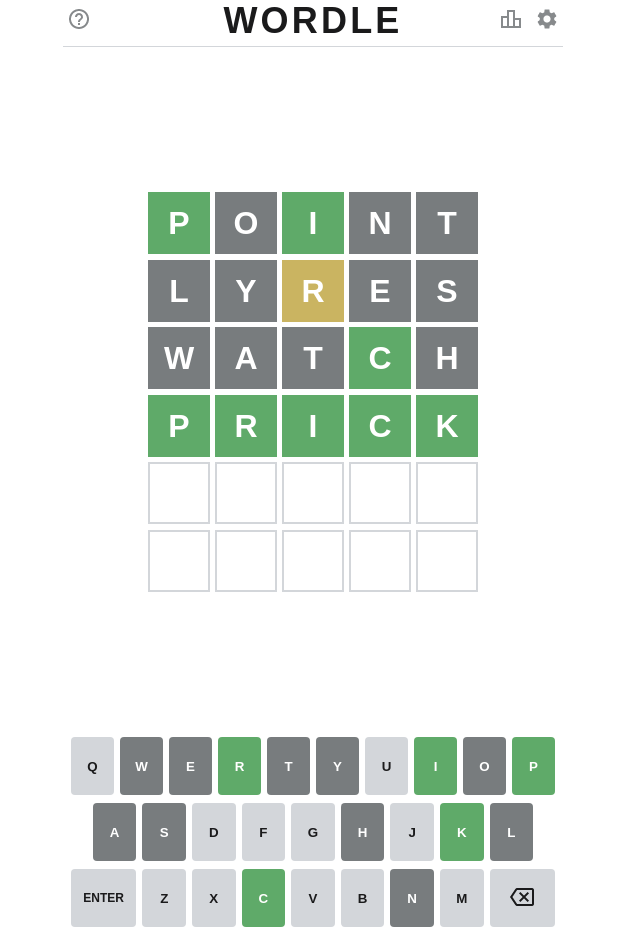

# wordle-helper

Usage: 

`wordle <fixed letters and wildcards> <letters somewhere in the word> <letter nowhere in the word>`

First argument is letters where you know the place. Fill with \* if you don't know. Second arguments is all the letters you don't know the place of, but are in the word. Third arguments is the letters that can't be in the word. Second and third arguments can be empty.

What I like about this tool is that I can use it to see the possible answers, but also to choose a word that will help me the most.

Example of a session with it:

I start with POINT. I get P and I as letters on the correct spot. I want to list words that start with p, have i as a third letter and don't contain the letters o, n and t:

```shell
$ wordle "p*i**" "" ont
paiks
pails
paire
pairs
...
```

Okay, I want a word that contains r, s, e and y to discriminate between these inputs. Probably not the best stategy but it was late:

```shell
$ wordle "*****" rsey
arsey
ayres
breys
byres
...
```

I forgot something: I don't want any p or i in the next word I play, since I already know they are here:

```shell
$ wordle "*****" rsey pi
arsey
ayres
breys
byres
...
```

You can't see it on the cut version, but the first time I had "preys" in my word list, and now it's not here. I pick "lyres". "lyres" gives me one letter in the wrong spot: R.

```shell
$ wordle "p*i**" r ontlyes
prick
prima
primi
primp
```

Already only 4 words. This part is a bit tricky. I want a word that has either a c or a k to know if prick is the answer. I would also want a "a" for "prima":

```shell
$ wordle "*****" ca 
abaca
abaci
abacs
abcee
...
```

Let's go with "watch". C is confirmed on "watch", the result is prick. Just to be sure:

```shell
$ wordle "p*ic*" r ontlyeswat
prick
```

I can then input the winning word of the day, "prick":



## Making of

Two lists of words:

- allowed-guesses.txt
- answers.txt

I want just one list, sorted: `cat allowed-guesses.txt answers.txt | sort > words.txt`. Could add `| uniq` before `> words.txt`: `cat allowed-guesses.txt answers.txt | sort | uniq > words.txt` but wasn't needed here.

Regexes: Nice for string manipulation, better than doing everthing "by hand". Example in [this commit](https://github.com/lucas-deangelis/wordle-helper/commit/8df9ad383066afe6f1ddb329fc4cd8a98a7aa878). Rely on the platform!

## Ideas to explore

- Put the words inside the binary
- Take dictionnary as parameter
- UTF-8 support so it works for all languages? Since I rely on characters this is going to be a fun one
- Remove dependency on Dune? Or just an alternative.

## To install

You'll need:

- OCaml
- dune
- opam

Clone the repo, `dune build` inside. The library used (str) is distributed with the compiler.